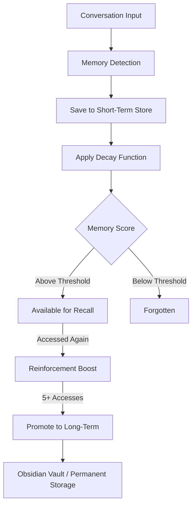
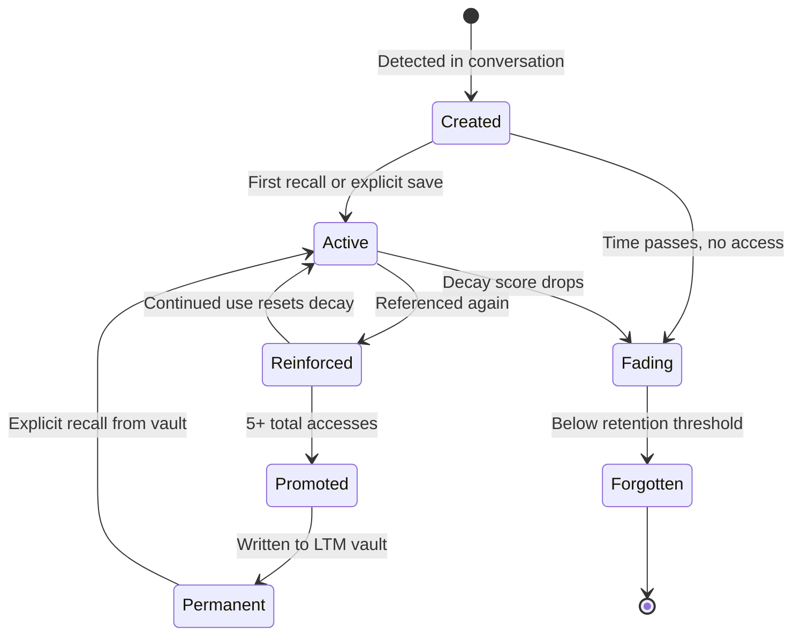

# MemCurve — Temporal Memory for AI Assistants

<p align="center">
  <a href="https://www.python.org/downloads/"></a>
  
  
  
</p>

> **Human-like memory dynamics for LLM agents.** MemCurve implements the Ebbinghaus forgetting curve so memories fade naturally unless reinforced through use — combining recency, frequency, and importance scoring with MCP server integration for persistent, context-aware AI assistants.

---

## Table of Contents

- [The Problem](#the-problem)
- [The Solution](#the-solution)
- [Key Features](#key-features)
- [How It Works](#how-it-works)
- [Memory Lifecycle](#memory-lifecycle)
- [Architecture](#architecture)
- [Scoring Algorithm](#scoring-algorithm)
- [Quickstart](#quickstart)
- [MCP Tools Reference](#mcp-tools-reference)
- [Configuration](#configuration)
- [Use Cases](#use-cases)
- [Project Structure](#project-structure)
- [License](#license)
- [Author & Contact](#-author--contact)

---

## The Problem

Every AI assistant conversation starts from zero. You tell Claude your preferences, project context, and decisions — then three days later, you repeat yourself. Existing memory systems make this worse with naive approaches:

| Approach | Problem |
|---|---|
| **"Delete after 7 days"** | Throws away frequently-used memories just because they're old |
| **"Keep last 100 items"** | Discards important context when the buffer fills |
| **Vector similarity only** | No concept of memory strength or natural decay |
| **Explicit flashcards** | Requires users to manually manage what to remember |
| **Permanent storage** | Never forgets irrelevant information, polluting context |

MemCurve models memory the way humans actually work — **memories fade unless reinforced**.

---

## The Solution

MemCurve applies cognitive-science principles to AI memory management. Every memory has a **decay score** that decreases over time but gets reset when the memory is accessed. Frequently used memories are **promoted** to long-term permanent storage.



---

## Key Features

### Natural Memory Decay
- Implements the **Ebbinghaus forgetting curve** — memories lose strength exponentially over time
- Decay rate is configurable per memory type (preferences decay slower than transient facts)
- Background scheduler runs decay analysis on a configurable cron schedule

### Reinforcement Through Use
- Every time a memory is recalled in conversation, its strength increases
- Access frequency and recency are combined into a composite retention score
- Recently reinforced memories resist decay for extended periods

### Long-Term Promotion
- Memories accessed **5+ times** are automatically promoted to long-term storage
- Promoted memories are written to an Obsidian vault or SQLite permanent store
- Long-term memories are immune to decay unless explicitly deleted

### MCP Server Integration
- Full **Model Context Protocol** server for Claude Desktop, Cursor, and compatible assistants
- Memory CRUD operations exposed as MCP tools
- Auto-recall injects relevant memories into conversation context without explicit commands

### Semantic Memory Graph
- Discovers relationships between memories (e.g., "TypeScript preference" ↔ "dark mode preference")
- Cluster detection groups related memories for batch recall
- Graph visualization for memory exploration and debugging

### Multi-Storage Backend
- **SQLite** — default local storage with full-text search
- **pgvector** — PostgreSQL with vector similarity for scaled deployments
- **Obsidian vault** — markdown files for human-readable long-term memory

---

## How It Works

### 1. Memory Detection

During conversation, MemCurve's activation layer detects save-worthy content — preferences, decisions, facts, and project context — using pattern matching and entity extraction. No special commands required.

### 2. Decay Scoring

Each memory receives an initial strength score. Over time, the Ebbinghaus decay function reduces this score. The decay rate depends on memory type, importance flags, and time since last access.

### 3. Recall & Reinforcement

When a user message semantically matches stored memories, MemCurve auto-recalls the relevant ones and injects them into context. Each recall event resets the decay timer and boosts the memory's strength.

### 4. Promotion & Consolidation

High-frequency memories graduate to long-term storage. A background agent consolidates related short-term memories, merges duplicates, and writes promoted memories to the permanent vault.

---

## Memory Lifecycle



---

## Architecture

```
Conversation Input
    │
    ├─> Activation Layer ────────── pattern detection, entity extraction
    │       └─> Save Detector
    │
    ├─> Memory Store ────────────── SQLite / pgvector backend
    │       ├─> Short-Term Memory  (decaying entries)
    │       └─> Long-Term Memory   (permanent vault)
    │
    ├─> Decay Engine ────────────── Ebbinghaus curve computation
    │       └─> Decay Analyzer Agent (background cron)
    │
    ├─> Reinforcement Tracker ───── access count + recency scoring
    │
    ├─> Relationship Discovery ──── semantic memory graph
    │       └─> Cluster Detector Agent
    │
    ├─> LTM Promoter ────────────── 5+ access → permanent storage
    │       └─> Obsidian Vault Writer
    │
    └─> MCP Server Interface ────── tool calls for external assistants
            ├─> save_memory
            ├─> recall_memory
            ├─> list_memories
            └─> analyze_message
```

---

## Scoring Algorithm

MemCurve combines three signals into a composite retention score:

| Signal | Weight | Description |
|---|---|---|
| **Recency** | High | Time since last access — recent memories score higher |
| **Frequency** | Medium | Total access count — frequently used memories persist longer |
| **Importance** | Override | User-marked critical memories resist all decay |

```
retention_score = (frequency_weight × log(access_count + 1))
                + (recency_weight × exp(-decay_rate × days_since_access))
                + importance_bonus

if retention_score < threshold → memory forgotten
if access_count >= 5           → promote to long-term
```

---

## Quickstart

### Installation

```bash
pip install cortexgraph
# or from source:
git clone <repository-url> memcurve
cd memcurve
pip install -e .
```

### MCP Client Configuration

Add to Claude Desktop or Cursor MCP settings:

```json
{
  "mcpServers": {
    "memcurve": {
      "command": "python",
      "args": ["-m", "cortexgraph.server"],
      "env": {
        "CORTEXGRAPH_DB_PATH": "./memories.db",
        "CORTEXGRAPH_VAULT_PATH": "./obsidian_vault"
      }
    }
  }
}
```

### Python API

```python
from cortexgraph import MemoryStore

store = MemoryStore()

# Save a memory (auto-detected in MCP mode)
store.save("User prefers TypeScript over JavaScript for all new projects")

# Recall relevant memories
memories = store.recall("What programming language should I use?")
for m in memories:
    print(f"[{m.score:.2f}] {m.content}")

# Mark as critical (never decays)
store.save("User is allergic to peanuts", importance="critical")
```

---

## MCP Tools Reference

| Tool | Description |
|---|---|
| `save_memory` | Store a new memory with optional importance flag |
| `recall_memory` | Retrieve memories matching a query |
| `list_memories` | List all active memories with decay scores |
| `delete_memory` | Permanently remove a memory |
| `analyze_message` | Detect save-worthy content in a message |
| `consolidate_memories` | Merge duplicates and promote eligible memories |
| `graph_memories` | Return memory relationship graph |

---

## Configuration

Key environment variables:

| Variable | Default | Description |
|---|---|---|
| `CORTEXGRAPH_DB_PATH` | `./cortexgraph.db` | SQLite database path |
| `CORTEXGRAPH_VAULT_PATH` | — | Obsidian vault for LTM storage |
| `DECAY_RATE` | `0.1` | Ebbinghaus decay rate constant |
| `PROMOTION_THRESHOLD` | `5` | Access count for LTM promotion |
| `FORGET_THRESHOLD` | `0.05` | Minimum retention score before forgetting |

---

## Use Cases

| Scenario | MemCurve Behavior |
|---|---|
| **Personal preferences** | "I prefer dark mode" → recalled weeks later when discussing UI |
| **Project context** | Architecture decisions persist across coding sessions |
| **Team knowledge** | Shared MCP server gives all team members consistent context |
| **Research notes** | Important findings promoted to Obsidian vault automatically |
| **Privacy-sensitive** | Transient facts decay naturally without manual cleanup |

---

## Project Structure

```
memcurve/
├── src/cortexgraph/
│   ├── server.py            # MCP server entry point
│   ├── storage/             # SQLite + pgvector backends
│   ├── decay/               # Ebbinghaus decay models
│   ├── activation/          # Save detection & auto-recall
│   ├── agents/              # Background agents (decay, promote, cluster)
│   └── tools/               # MCP tool implementations
├── schemas/                 # SQL schemas, decay design docs
├── docs/                    # Full documentation (MkDocs)
├── examples/                # Claude Desktop config, usage examples
└── tests/                   # 791+ tests, 98%+ coverage
```

---

## License

AGPL-3.0 — see [LICENSE](LICENSE) for details.

---

## 👤 Author & Contact

- **Author**: Nathaniel Gordon
- **Role**: Senior AI & Machine Learning Engineer
- **GitHub**: [github.com/nathaniel-gordon](https://github.com/nathaniel-gordon)
- **Portfolio / Upwork**: [upwork.com/freelancers/~015fe5a704f8943797](https://www.upwork.com/freelancers/~015fe5a704f8943797)
- **Email**: nathanielgordon346@gmail.com
- **Location**: Tallahassee, FL, USA
